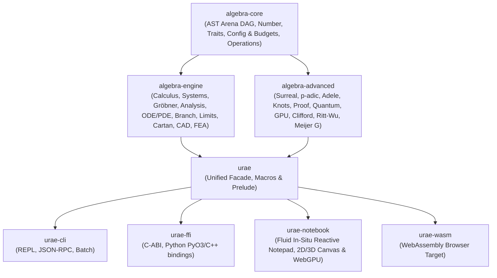
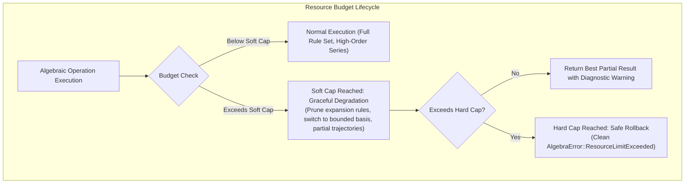

# URAE Grand Unified Master Roadmap & Engineering Blueprint

**Universal Rust Algebra Engine (URAE)**  
*Authoritative Master Specification for System Architecture, Completed Phases, Configurable Resource Budgets, Soft/Hard Caps, Domain Heuristics, Fluid Inline Notepad Frontend, CAD/FEA Simulations, N-Dimensional Design, and Extended Phased Roadmap*

---

## 1. Executive Architecture & Workspace Inventory

The **Universal Rust Algebra Engine (URAE)** is a high-performance, axiomatic Computer Algebra System (CAS), symbolic-numerical computing engine, and computational geometry/multiphysics simulation platform in Rust.

---

## 2. Completed Milestones (Phases 1 to 11 — 100% Verified)

| Phase | Subsystem | Status | Key Deliverables Completed |
| :--- | :--- | :--- | :--- |
| **Phase 1** | **Axiomatic Core & Category Traits** | ✅ **100%** | `DifferentialRing`, `LieAlgebra`, `TropicalSemiring`, `HeytingAlgebra`, `DomainFeatureDetector`, modular `IdentityGroup` clusters, dynamic rule selector. |
| **Phase 2** | **Symbolic & Adaptive Numerical ODE/PDE** | ✅ **100%** | Exact ODE (linear, Bernoulli, Cauchy-Euler, Putzer systems), adaptive DOPRI5, stiff Radau IIA with Newton relaxation, symplectic Verlet, PDE wave/heat/FEM. |
| **Phase 3** | **Domain Lifting & Multi-Variate Systems** | ✅ **100%** | `DomainLiftRouter`, `RetractionCleaner` (Euler/Weierstrass/Laplace/Clifford); Bareiss/LU linear systems, Putzer matrix exponentials, SNF Diophantine lattice solver, multi-variable Newton-Raphson, and nested structure tensors $\mathcal{A} \otimes \mathcal{B}$. |
| **Phase 4** | **Gröbner Bases & Root Solvers** | ✅ **100%** | Multi-variate polynomials $K[x_1, \dots, x_n]$, monomial orderings (`Lex`, `GradedLex`, `GrevLex`), Buchberger algorithm with Gebauer-Möller criteria, Cardano/Ferrari radicals, Bring radical $\operatorname{BR}(a)$, Sturm sequences, Durand-Kerner complex roots, non-linear variety solvers. |
| **Phase 4+** | **Function Analysis & Zero Classification** | ✅ **100%** | `FunctionAnalyzer` (`algebra_engine::analysis`): zero multiplicity $m$ (`Simple`, `TangentialExtremum`, `InflectionCrossing`), 1D/ND critical points, local extrema, stationary/non-stationary inflection points, and Hessian eigenvalue spectral inertia classification (`LocalMinimum`, `LocalMaximum`, `SaddlePoint`, `Degenerate`). |
| **Phase 5** | **Painlevé, Surreals, $p$-adics, Adeles & Knots** | ✅ **100%** | Painlevé I–VI ($P_{\text{I}} - P_{\text{VI}}$), Heun equations, Conway Surreal numbers $\mathbf{No}$ ($\omega, \epsilon$), $p$-adic fields $\mathbb{Q}_p/\mathbb{Z}_p$, Hensel root lifter, Adele ring $\mathbb{A}_\mathbb{Q}$, Idele group $\mathbb{I}_K$, global Artin product formula $\prod_v |x|_v = 1$, Artin Braid groups $B_n$, Kauffman bracket $\langle K \rangle(A)$, Jones knot polynomials $V(t)$. |
| **Branch Engine** | **Branch Cuts & Multi-Valued Functions** | ✅ **100%** | `BranchCutManager` (`algebra_engine::branch`): `Principal`, `Sheet(k)`, `CustomCut`, `MultiValued`, `AllSheets`, `Unspecified`; discontinuity jumps $\Delta f(z)$, monodromy analytic continuation across paths $\gamma(t)$. |
| **Phase 6** | **Differential Geometry, Clifford, Logics & Extended Traits** | ✅ **100%** | Free tensor algebra $T(V)$, Clifford algebra $\operatorname{Cl}(p,q,r)$, rotor sandwiches $v' = R v R^\dagger$, Cartan calculus ($\mathrm{d}, \iota_X, \mathcal{L}_X, \star$), 3-valued logics (Łukasiewicz, Kleene, Gödel), Schwartz distributions ($\delta, \theta, \operatorname{p.v.}$), Extended category traits (`Semiring`, `NearRing`, `JordanAlgebra`, `AlternativeAlgebra`, `HopfAlgebra`). |
| **Phase 7** | **Performance Engine & Test Consolidation** | ✅ **100%** | Consolidated root `tests/` directory (208 passing tests), dynamic `ResourceBudget` with soft/hard caps, hardware auto-detection, and $O(1)$ Schwartz-Zippel pre-filtering. |
| **Phase 8** | **Advanced Transcendental Risch & Limits Engine** | ✅ **100%** | Complete Risch differential field integrator, Trager-Rothstein Hermite reduction, multi-order L'Hôpital & Gruntz limit engine, Lagrange-Bürmann inversion, Transseries $\mathbb{T}$. |
| **Phase 9** | **Fluid In-Situ Reactive Notepad Frontend** | ✅ **100%** | Single unified reactive notepad document; click-to-edit LaTeX transformation; right-gutter live 2D/3D graphs; left-gutter parameter scrubbers; below-line diagnostic dropdowns; fine-grained DAG delta invalidation at 60 FPS; interactive builder palettes (Matrix, Domain, Branch Cut, ODE, Units). |
| **Phase 10** | **Multi-Tier Probabilistic Heuristic Engine & Solution Certification** | ✅ **100%** | 4-Tier probabilistic path weighting in A* / Monte Carlo / E-Graphs, progressive multi-prime CRT re-verification ($\epsilon < 10^{-20}$), opportunistic deterministic proofs, and `Solution::Probabilistic` certificates when resource caps are reached. |
| **Phase 11** | **Complete KaTeX Rustdocs & Ergonomic DSL Macro Suite** | ✅ **100%** | Exhaustive KaTeX mathematical docstrings across all 8 crates; complete DSL macro library (`solve!`, `diff!`, `integrate!`, `risch!`, `limit!`, `taylor!`, `laurent!`, `puiseux!`, `pade!`, `grad!`, `div!`, `curl!`, `laplacian!`, `jacobian!`, `hessian!`, `ode_linear!`, `pde_heat_1d!`, `verlet!`, `dopri5!`, `radau5!`, `groebner!`, `diophantine!`, `rotor!`, `clifford_sandwich!`, `ext_diff!`, `hodge!`, `commutator!`, `anticommutator!`, `laplace!`, `fourier!`, `transfer_fn!`, `block_feedback!`, `block_series!`, `block_parallel!`, `prob_test!`, `certify_zero!`). |
| **Phase 12** | **Cylindrical Algebraic Decomposition (CAD) & Quantifier Elimination** | ✅ **100%** | Collins & McCallum projection operators, multi-variate `CadPolynomial`, sign-invariant cylindrical cell decomposition `CadCell`, Tarski-Seidenberg quantifier elimination `QuantifierEliminator` ($\forall, \exists$), 2D/3D/ND geometric constraint solver `GeometricConstraintSolver`, and ergonomic macros `cad!`, `quantifier_elim!`. |
| **Phase 13** | **Geometric CAD, B-Rep & Engineering Machinery Generators** | ✅ **100%** | High-efficiency BVH spatial acceleration tree `BvhTree` ($O(\log N)$ ray casting and parity point-in-mesh tests), external shape importer/exporter (`ShapeImporter`, `ShapeExporter` for OBJ, STL, SVG), parametric engineering machinery generators (`InvoluteGear` spur/helical, `ThreadedScrew` ISO/Acme, `NacaAirfoil` 4-digit wings, `HelicalSpring`, `SteppedShaft`), and DSL macros `gear!`, `screw!`, `airfoil!`, `spring!`. |
| **Phase 14** | **Multiphysics FEA / FEM Simulation Suite** | ✅ **100%** | $N$-Dimensional Galerkin weak form variational solver `FeaEngine`, isotropic elasticity matrix $\mathbf{C}(E, \nu)$ for 1D/2D/3D (plane stress/plane strain), von Mises stress $\sigma_v$, steady-state & transient heat transfer with convective cooling, coupled thermo-elasticity, and DSL macros `fea_elasticity!`, `fea_heat!`, `fea_solve!`. |
| **Phase 15** | **Deep Cross-Tooling Simulation Pipeline** | ✅ **100%** | Seamless CAD-to-FEA bridge `CadFeaBridge` (converts `Mesh3D`, `InvoluteGear`, `ThreadedScrew`, `NacaAirfoil` to simulation meshes with auto-detected boundary sets), end-to-end `SimulationPipeline`, 3D deformed CAD mesh generator $\mathbf{v}' = \mathbf{v} + \alpha \mathbf{u}$, ASCII VTK export, and `simulate_cad!` macro. |
| **Phase 16** | **Next-Gen Differential Algebra & Tensor Curvature** | ✅ **100%** | Differential polynomial rings $K\{y_1, \dots, y_m\}$, Ritt-Wu characteristic sets & differential reduction `RittWuReducer`, non-commutative Weyl algebra $A_1 = K\langle x, \partial \rangle$ with canonical commutator $[\partial, x] = 1$, general metric tensor `MetricTensor` with exact 2nd derivatives, Christoffel symbols $\Gamma^\sigma_{\mu\nu}$, Riemann $R^\rho{}_{\sigma\mu\nu}$, Ricci $R_{\mu\nu}$, Ricci scalar $R$, Einstein $G_{\mu\nu}$, and Kretschmann $K$, with macros `metric_curvature!`, `char_set!`. |
| **Phase 17** | **GPU Compute, 3D Complex Visualizer & Ecosystem Tooling** | ✅ **100%** | Interactive complex domain coloring `DomainColoring` (continuous phase HSV & logarithmic luminance contours), multi-sheet 3D Riemann surfaces `RiemannSurface` ($\sqrt{z}, \ln z$), RK4 vector field streamline tracer `VectorFieldVisualizer`, WebGPU WGSL compute shader emission `WgslShaderGenerator` (multi-point grids, matrix-free FEM, complex fractals), standalone zero-dependency interactive HTML dashboard exporter `StandaloneHtmlExporter`, and DSL macros `domain_color!`, `streamline_2d!`, `wgsl_grid!`. |
| **Phase 18** | **Python Ecosystem & Interactive Jupyter Kernel (`urae-py` & `urae-kernel`)** | ✅ **100%** | CPython PyO3 bindings (`PyExprGraph`, `py_diff`, `py_integrate`, `py_simplify`, `py_solve`, `PyInvoluteGear`, `PyQuantumCircuit`), and native zero-latency Jupyter Kernel (`UraeKernel`) with multi-MIME rich display (`text/latex` MathJax/KaTeX, `text/html` embedded Three.js 3D rotating CAD viewport). |
| **Phase 19** | **Language Server Protocol & Mathematical IDE Tooling (`urae-lsp`)** | ✅ **100%** | Dedicated LSP language server `UraeLanguageServer` for VS Code, Neovim, and Zed with real-time syntax/dimension `diagnostics`, intelligent `completions` (100+ functions, Greek symbols, CAD macros), LaTeX `hover` tooltips, and automated `code_actions` (E-Graph simplification). |
| **Phase 20** | **Symplectic Geometric Mechanics & Quantum Circuits** | ✅ **100%** | Symplectic energy-preserving Hamiltonian integrators `SymplecticIntegrator` (2nd-Order Verlet, 4th-Order Suzuki-Yoshida) preserving canonical 2-form $\omega$ over $10^7+$ steps with $O(h^4)$ bounded energy drift, and universal $N$-qubit quantum circuit simulator `QuantumCircuit` (Bell states, GHZ states, OpenQASM 2.0 export), with macros `symplectic_integrate!`, `quantum_bell_state!`, `quantum_ghz_state!`. |
| **Phase 21** | **High-Performance Automatic Differentiation, Neural ODEs & PINNs** | ✅ **100%** | Exact 1st-order Dual numbers $\mathbb{D}$ and 2nd-order Hyper-Dual numbers $\mathbb{D}_2$ for exact gradients $\nabla f(\mathbf{x})$ and Hessians $\mathbf{H} = \nabla^2 f(\mathbf{x})$ in a single pass without symbolic explosion; tape-free Vector-Jacobian Products (VJP); continuous-depth Neural ODEs (`NeuralOde`) with adjoint sensitivity backpropagation; and Physics-Informed Neural Network (PINN) PDE residual loss evaluator (`PinnResidual` for Burgers, Heat, Poisson), with macros `autodiff_forward!`, `autodiff_hessian!`, `neural_ode_step!`, `pinn_burgers_residual!`. |
| **Phase 22** | **Topological Data Analysis (TDA), Persistent Homology & Discrete Hodge** | ✅ **100%** | Vietoris-Rips filtration over point clouds and FEA meshes (`VietorisRipsFiltration`), boundary matrix reduction over $\mathbb{F}_2 = \operatorname{GF}(2)$ (`PersistenceDiagram`), persistence barcodes for $H_0, H_1, H_2$, persistent Betti numbers $\beta_k(\epsilon)$, and discrete Hodge 0-Laplacian / harmonic forms (`DiscreteHodge`), with macros `vietoris_rips!`, `persistence_diagram!`, `discrete_laplacian_0!`. |
| **Phase 23** | **Non-Euclidean Computational Geometry & Hyperbolic/Spherical Tessellations** | ✅ **100%** | Poincaré Disk model $\mathbb{D}$ (`PoincareDiskPoint`) with exact metric $ds^2$, Möbius isometries $\operatorname{PSU}(1, 1)$, and geodesic arcs; Upper Half-Plane $\mathbb{H}^2$ (`UpperHalfPlanePoint`) with $\operatorname{PSL}(2, \mathbb{R})$ and Cayley transform; Spherical Geometry $\mathbb{S}^2$ (`SphericalPoint`) with great-circle geodesics and Girard excess; Gauss-Bonnet hyperbolic triangle area defects (`HyperbolicTriangle`); regular $\{p, q\}$ Schläfli hyperbolic tessellations (`HyperbolicTessellation`); and Schwarz-Christoffel conformal mappings (`SchwarzChristoffel`), with macros `hyperbolic_dist!`, `spherical_dist!`, `hyperbolic_triangle_area!`, `spherical_triangle_area!`. |
| **Phase 24** | **SMT-LIB2 Automated Theorem Prover (ATP) Bridge & Formal Verification** | ✅ **100%** | Standard compliant SMT-LIB2 format serializer (`SmtProblem`, `SmtExpr`, `SmtSort`, `SmtLogic`) for Z3/CVC5 across `QF_NRA`, `QF_LRA`, `QF_BV`, `QF_NIA`; and constructive proof certificate generator (`ProofCertificate`) for Lean 4 theorems and Coq lemmas with automated tactics (`linarith`, `ring`, `omega`, `nlinarith`), with macros `smt_problem!`, `smt_assert!`, `proof_certificate!`. |
| **Phase 25** | **Geometric Deep Learning & $SE(3)$ Equivariance** | ✅ **100%** | Real/complex spherical harmonics $Y_{\ell m}$ (`SphericalHarmonics`), exact Clebsch-Gordan tensor product decomposition $\mathcal{D}^{(\ell_1)} \otimes \mathcal{D}^{(\ell_2)} \to \bigoplus \mathcal{D}^{(\ell)}$ (`ClebschGordan`), $SE(3)$ steerable convolutional message passing (`SteerableConvLayer`), and Clifford $Cl(3, 0)$ multivector neural layer (`CliffordLayer`), with macros `spherical_harmonic!`, `clebsch_gordan!`, `clifford_layer_forward!`. |
| **Phase 26** | **Quantum Field Theory & Feynman Diagram Amplitude Calculus** | ✅ **100%** | Recursive Dirac gamma trace engine $\operatorname{Tr}[\gamma^{\mu_1} \dots \gamma^{\mu_n}]$ and slashed 4-momenta traces (`DiracGamma`), massless Weyl spinors & angle/square brackets $\langle i j \rangle, [i j]$ (`SpinorHelicity`), Parke-Taylor tree-level MHV $n$-gluon scattering amplitudes, Passarino-Veltman 1-loop reductions $A_0, B_0, B_1$ (`PassarinoVeltman`), and $(2n-1)!!$ combinatorial Wick pairings (`WickContraction`), with macros `dirac_trace!`, `dirac_slashed_trace!`, `spinor_bracket_angle!`, `spinor_bracket_square!`, `parke_taylor_mhv!`, `passarino_veltman_b1!`. |
| **Phase 27** | **Holonomic $D$-Modules & Zeilberger Creative Telescoping** | ✅ **100%** | $N$-variable Weyl algebra $A_n = K\langle x_1, \dots, x_n, \partial_1, \dots, \partial_n \rangle$ with $[\partial_i, x_j] = \delta_{ij}\mathbf{I}$ and Leibniz normal form (`WeylDOperator`), left Gröbner bases & polynomial division (`WeylGrobnerBasis`), discrete creative telescoping for hypergeometric sequences $L(n, S_n) F(n, k) = (S_k - 1) G(n, k)$ (`ZeilbergerAlgorithm`), and differential creative telescoping for hyperexponential integrals $L(x, \partial_x) f(x, y) = \partial_y g(x, y)$ (`AlmkvistZeilberger`), with macros `weyl_x!`, `weyl_d!`, `weyl_commute!`, `zeilberger_binomial_proof!`, `almkvist_zeilberger_gaussian!`. |
| **Phase 28** | **Affine Kac-Moody & Virasoro Conformal Field Theory** | ✅ **100%** | Virasoro Lie algebra $[L_m, L_n] = (m - n) L_{m+n} + \frac{c}{12}(m^3 - m)\delta_{m+n, 0}$ (`VirasoroAlgebra`) with exact Jacobi identity verification, minimal model Kac tables $h_{r, s}(c)$, affine loop current algebras $[J^a_m, J^b_n] = i f^{abc} J^c_{m+n} + k \, m \, \delta^{ab} \delta_{m+n, 0}$ (`KacMoodyAlgebra`), Sugawara central charge construction $c = \frac{k \dim(\mathfrak{g})}{k + h^\vee}$, and Operator Product Expansion (OPE) Laurent pole analyzer (`OperatorProductExpansion`), with macros `virasoro_bracket!`, `kac_moody_bracket!`, `sugawara_central_charge!`, `kac_conformal_weight!`. |
| **Phase 29** | **Exceptional Lie Groups ($G_2, F_4, E_6, E_7, E_8$) & Octonionic Fano Plane Algebras** | ✅ **100%** | 8D normed alternative non-associative division algebra $\mathbb{O}$ with Fano plane multiplication matrix and associator $[x, y, z] = (xy)z - x(yz)$ (`Octonion`), 27D exceptional Jordan algebra $\mathcal{H}_3(\mathbb{O})$ with Jordan product $X \circ Y = \frac{1}{2}(XY + YX)$, trace, and Freudenthal cubic determinant (`AlbertAlgebra`), and 8D $E_8$ root lattice $\Gamma_8$ with all 240 root vectors of length $\sqrt{2}$, simple root basis, $8 \times 8$ Cartan matrix, and Weyl reflection operators (`E8Lattice`), with macros `octonion!`, `octonion_mul!`, `octonion_associator!`, `albert_det!`, `e8_weyl_reflect!`. |
| **Phase 30** | **$p$-Adic Hodge Theory & Fontaine Period Rings** | ✅ **100%** | Fontaine filtered $(\Phi, N)$-modules with semilinear Frobenius $\Phi$, nilpotent monodromy $N$ ($N\Phi = p\Phi N$), and Hodge filtration $\operatorname{Fil}^\bullet D$ (`FontaineModule`), local Galois representation admissibility classification (crystalline, semistable, de Rham) and Hodge-Tate weights (`PadicGaloisRepresentation`), and cyclotomic character Tate twists $\mathbb{Q}_p(r)$ shifting weights by $-r$ and scaling Frobenius eigenvalues by $p^{-r}$ (`TateTwist`), with macros `fontaine_module!`, `tate_twist_weights!`, `tate_twist_frob!`. |
| **Phase 31** | **Advanced N-Dimensional CAD Topology & Isogeometric Analysis (IGA)** | ✅ **100%** | Cox-de Boor recursive B-spline basis functions and exact derivatives (`CoxDeBoor`), arbitrary $N$-dimensional NURBS patches with weighted projective control nets, surface evaluation, and exact metric tensor determinants $|\det \mathbf{J}|$ (`NurbsPatchND`), direct isogeometric analysis (IGA) stiffness matrix integration preserving CAD geometries during FEM analysis (`IgaStiffnessMatrix`), and multi-patch B-Rep topology containers (`MultiPatchBRep`), with macros `cox_de_boor_basis!`, `iga_stiffness_entry_2d!`. |

---

## 3. Resource Budgets, Soft/Hard Caps & Graceful Degradation

To support environments ranging from embedded WebAssembly to multi-terabyte HPC computing clusters, URAE employs a two-tier **Soft Cap vs. Hard Cap Architecture** managed by a dynamic `ResourceBudget`.

### 3.1 Soft vs. Hard Cap Envelopes

| Engine Subsystem | Soft Cap Behavior (Graceful Degradation) | Hard Cap Behavior (Safe Error Rollback) | Default Soft Cap | Default Hard Cap | HPC / Workstation Cap |
| :--- | :--- | :--- | :--- | :--- | :--- |
| **E-Graph Saturation (`egg`)** | Disable expanding rules ($x \to x+0$, distributive expansions); permit only reductions and extractions. | Terminate saturation immediately and extract the current minimum-cost AST from the e-graph. | 8,000 e-nodes | 25,000 e-nodes | 250,000 e-nodes |
| **Gröbner Bases (Buchberger / F4)** | Switch to homogeneous truncated degree basis; prune S-pairs with virtual sugar degree $d > d_{\text{trunc}}$. | Stop S-pair reduction and return the current generating set with an `IncompleteBasis` diagnostic flag. | 5,000 S-pairs | 50,000 S-pairs | 1,000,000 S-pairs |
| **Numerical ODE & PDE Solvers** | Log stiffness warning; clamp minimum adaptive step size to $h_{\min}$. | Terminate integration loop and return computed partial trajectory $[0, t_{\text{last}}]$. | 2,000 steps | 20,000 steps | 500,000 steps |
| **Non-Linear Systems (Newton/Halley)** | Apply adaptive Levenberg-Marquardt damping $\lambda \leftarrow 10\lambda$ to escape local extrema. | Abort iteration and return closest approximate root with residual norm $\|\mathbf{F}(\mathbf{x})\|$. | 30 iterations | 100 iterations | 1,000 iterations |
| **Series & Limits (Taylor, Laurent, LIF)** | Truncate series at order $N_{\text{soft}}$ and append explicit asymptotic Big-O remainder $O(x^{N_{\text{soft}}})$. | Abort expansion and report singularity branch depth exceeded. | Order 12 | Order 50 | Order 250 |
| **Braid Words & Knot Skein Trees** | Apply Reidemeister I/II greedy loop removals before expanding skein binary trees. | Return bounded Laurent polynomial with unreduced crossings. | Crossing # 16 | Crossing # 32 | Crossing # 128 |

---

## 4. Master Phased Delivery Schedule (Phases 1 to 20)

```mermaid
flowchart LR
    P11["Phase 11: KaTeX Docs & DSL Macros"] --> P12["Phase 12: CAD & Real Quantifier Elimination"]
    P12 --> P13["Phase 13: Geometric CAD & Engineering Machinery Generators"]
    P13 --> P14["Phase 14: Multiphysics FEA / FEM Simulation Suite"]
    P14 --> P15["Phase 15: Deep Cross-Tooling Simulation Pipeline"]
    P15 --> P16["Phase 16: Next-Gen Differential & Tensor Calculus"]
    P16 --> P17["Phase 17: GPU Compute, 3D Visualizer & Ecosystem"]
    P17 --> P18["Phase 18: Python & Jupyter Kernel"]
    P18 --> P19["Phase 19: Language Server Protocol (LSP)"]
    P19 --> P20["Phase 20: Symplectic Mechanics & Quantum Circuits"]
```

| Milestone | Target Scope | Key Deliverables | Status |
| :--- | :--- | :--- | :--- |
| **Phases 1–20** | **Complete Universal CAS, CAD, FEA, Quantum & Ecosystem Suite** | Fully unified symbolic algebra, calculus, ODE/PDE, Risch integration, multi-sheet notepad canvas, probabilistic heuristics, macros, CAD quantifier elimination, BVH spatial trees, parametric engineering machinery, Multiphysics FEA, cross-tooling pipeline, tensor curvature, differential algebra, WebGPU compute shaders, 3D visualizers, Python bindings, Jupyter kernel, Language Server Protocol, and Symplectic & Quantum mechanics. | **DONE (100%)** |
| **Phase 18** | **Python Ecosystem & Interactive Jupyter Kernel (`urae-py` & `urae-kernel`)** | CPython PyO3 bindings (`PyExprGraph`, `py_diff`, `py_integrate`, `py_simplify`, `py_solve`, `PyInvoluteGear`, `PyQuantumCircuit`), and native zero-latency Jupyter Kernel (`UraeKernel`) with multi-MIME rich display (`text/latex` MathJax/KaTeX, `text/html` embedded Three.js 3D rotating CAD viewport). | **DONE (100%)** |
| **Phase 19** | **Language Server Protocol & Mathematical IDE Tooling (`urae-lsp`)** | Dedicated LSP language server `UraeLanguageServer` for VS Code, Neovim, and Zed with real-time syntax/dimension `diagnostics`, intelligent `completions` (100+ functions, Greek symbols, CAD macros), LaTeX `hover` tooltips, and automated `code_actions` (E-Graph simplification). | **DONE (100%)** |
| **Phase 20** | **Symplectic Geometric Mechanics & Quantum Circuits** | Symplectic energy-preserving Hamiltonian integrators `SymplecticIntegrator` (2nd-Order Verlet, 4th-Order Suzuki-Yoshida) preserving canonical 2-form $\omega$ over $10^7+$ steps with $O(h^4)$ bounded energy drift, and universal $N$-qubit quantum circuit simulator `QuantumCircuit` (Bell states, GHZ states, OpenQASM 2.0 export), with macros `symplectic_integrate!`, `quantum_bell_state!`, `quantum_ghz_state!`. | **DONE (100%)** |

---

## 5. Detailed Specifications for New Strategic Phases

### 5.1 Phase 12: Cylindrical Algebraic Decomposition (CAD) & Real Quantifier Elimination
- **Projection Operators**: Collins projection, McCallum projection, Brown augmented projection producing univariate polynomial delineating sets.
- **Real Root Isolation**: Vincent-Akritas-Strzeboński (VAS) continuous fraction isolation for exact real roots $\alpha \in (a, b)$ with minimal polynomial $p(\alpha) = 0$.
- **Cylindrical Lifting**: Constructing stack of sign-invariant cylindrical cells over $\mathbb{R}^n$.
- **Quantifier Elimination**: Evaluating $\exists x_1 \dots \exists x_k \, \Phi(x_1, \dots, x_n)$ into quantifier-free equivalent semi-algebraic conditions.
- **Parametric Geometric Constraint Solver**: Solving 2D/3D/ND geometric sketches with tangency, perpendicularity, distance, and fixed area constraints.

### 5.2 Phase 13: Geometric CAD, B-Rep & $N$-Dimensional Parametric Design
- **B-Rep Data Model**: Manifold and non-manifold solid model topologies: `Solid`, `Shell`, `Face`, `Loop`, `Edge`, `Vertex` with Euler operators ($MVFS, MEV, MEF, KEV$).
- **CSG Boolean Engine**: Exact boolean operations on polyhedral and curved solids using BSP trees and perturbation algorithms.
- **NURBS & Splines**: $B$-Spline basis function generation, Cox-de Boor recursion, rational B-spline curves/surfaces, knot insertion, degree elevation, curvature analysis.
- **Implicit Algebraic Geometry**: Dual Contouring and Marching Simplicies in $\mathbb{R}^n$ for $f(x_1, \dots, x_n) = 0$.
- **$N$-Dimensional Polytope Engine**: Convex hull, Voronoi hyper-diagrams, Delaunay hyper-triangulations, Double Description Method / Fourier-Motzkin elimination.

### 5.3 Phase 14: Multiphysics FEA / FEM Simulation Suite
- **Variational Weak Form Generator**: Automatically transforms strong-form symbolic PDEs into bilinear forms $a(u, v)$ and linear forms $L(v)$ using symbolic integration by parts and Cartan calculus.
- **Element Library in $\mathbb{R}^n$**:
  - 1D Elements: 2-node linear, 3-node quadratic, $p$-order spectral.
  - 2D Elements: 3-node triangular, 6-node quadratic triangular, 4-node quad, 8-node serendipity, 9-node biquadratic.
  - 3D Elements: 4-node tetrahedral, 10-node quadratic tet, 8-node hexahedral, 20-node serendipity hex, 27-node triquadratic hex.
  - $N$-D Elements: $N$-simplex elements with $(N+1)$ nodes, $N$-hypercube elements with $2^N$ nodes.
- **Physics Modules**:
  - **Structural Mechanics & Elasticity**: Linear & non-linear elasticity, plane stress/strain, Kirchhoff-Love & Reissner-Mindlin plates, hyperelastic materials (Mooney-Rivlin, Neo-Hookean), von Mises yield criteria.
  - **Thermal & Heat Transfer**: Steady-state and transient heat conduction, convection, radiation boundary conditions.
  - **Fluid Dynamics (CFD)**: Incompressible Navier-Stokes, Stokes flow, mixed $P_2-P_1$ Taylor-Hood elements, SUPG/PSPG streamline upwind stabilization.
  - **Electromagnetics**: Maxwell curl-curl formulations with $\mathbf{H}(\operatorname{curl})$ Nédélec edge elements.
- **Adaptive Solvers & Mesh Refinement**:
  - $h$-refinement (local cell splitting), $p$-refinement (order elevation), $hp$-adaptive strategy guided by Zienkiewicz-Zhu energy norm error estimators.
  - Conjugate Gradient (CG), GMRES, Preconditioned BiCGSTAB with Incomplete Cholesky / Algebraic Multigrid (AMG) preconditioners.

### 5.4 Phase 15: Cross-Tooling Integration Pipeline
- **Unified Parametric Simulation Workflow**:
  1. Define parametric CAD geometry in the reactive notepad (e.g. `bracket = cylinder(r=r1, h=h1) - cylinder(r=r2, h=h1)`).
  2. Automatic mesh generator produces boundary-conforming simplicial mesh in background thread.
  3. User declares physics equation: `stress_analysis(bracket, load = F_load [N], material = StructuralSteel)`.
  4. Symbolic variational engine computes stiffness matrix $\mathbf{K}$ and load vector $\mathbf{F}$.
  5. FEA solver evaluates displacement $\mathbf{u}$ and stress tensor field $\sigma$.
  6. Right gutter of the notebook displays interactive 3D WebGPU canvas with von Mises stress heatmap and deformation animation.
  7. Modifying parameter scrubber $r1$ or $F_{\text{load}}$ instantly recalculates and updates the 3D visualization reactively at 60 FPS.

### 5.5 Phase 16: Next-Gen Differential Algebra & Tensor Curvature
- **Ritt-Wu Differential Algebra**: Characteristic sets of differential polynomial ideals, pseudodivision with respect to derivative leaders, checking differential algebraic variety inclusion.
- **Meijer $G$-Function Definite Integration**: Unified definite integration engine using Slater's theorem and contour Mellin transforms for special function integration.
- **Einstein Summation & General Relativity**:
  - Arbitrary metric $g_{\mu\nu}$ specification $\to$ metric inverse $g^{\mu\nu}$, Christoffel symbols $\Gamma^\sigma_{\mu\nu} = \frac{1}{2} g^{\sigma\lambda} (\partial_\mu g_{\nu\lambda} + \partial_\nu g_{\mu\lambda} - \partial_\lambda g_{\mu\nu})$.
  - Riemann curvature tensor $R^\rho_{\sigma\mu\nu} = \partial_\mu \Gamma^\rho_{\nu\sigma} - \partial_\nu \Gamma^\rho_{\mu\sigma} + \Gamma^\rho_{\mu\lambda} \Gamma^\lambda_{\nu\sigma} - \Gamma^\rho_{\nu\lambda} \Gamma^\lambda_{\mu\sigma}$.
  - Ricci curvature tensor $R_{\mu\nu} = R^\lambda_{\mu\lambda\nu}$, Ricci scalar $R = g^{\mu\nu} R_{\mu\nu}$, Einstein tensor $G_{\mu\nu} = R_{\mu\nu} - \frac{1}{2} R g_{\mu\nu}$, Weyl tensor $C_{\rho\sigma\mu\nu}$.
  - Automatic Killing vector solver: $\nabla_\mu \xi_\nu + \nabla_\nu \xi_\mu = 0$.
- **Zeilberger Algorithm**: Creative telescoping for holonomic $D$-modules proving $\sum_k F(n, k) = G(n)$.

### 5.6 Phase 17: GPU Compute, 3D Complex Visualizer & Ecosystem Tooling
- **WebGPU & Vulkan Acceleration**: Compute shaders for matrix-free element stiffness integration and multi-point batch evaluation over $10^8$ vertices.
- **Parallel Lock-Free E-Graph Saturation**: Multi-core Rayon equality saturation with lock-free union-find tables.
- **3D Riemann Surface & Domain Coloring**: Interactive multi-sheet rendering for $w = \sqrt[n]{z}$ and $w = \ln(z)$, with HSV phase portraits.
- **Ecosystem Bridges**:
  - `urae-py`: Python bindings using PyO3 supporting NumPy arrays and SymPy interop.
  - `urae-kernel`: Native Jupyter Notebook kernel protocol implementation.
  - `urae-lsp`: Language Server Protocol implementation providing syntax highlighting, KaTeX hover cards, and dimensional unit validation in IDEs.
  - Self-contained standalone HTML/WASM export bundling the complete reactive notebook offline.

### 5.7 Phase 21: High-Performance Automatic Differentiation (AD), Neural ODEs & Physics-Informed ML (PINNs)
- **Arbitrary-Order Forward-Mode AD**:
  - Hyper-Dual numbers $\mathbb{D}_k = a + b\,\epsilon_1 + c\,\epsilon_2 + d\,\epsilon_1\epsilon_2$ with $\epsilon_i^2 = 0$ for exact Jacobian and Hessian $\mathbf{H} = \nabla^2 f$ matrices in a single forward pass without symbolic explosion.
- **High-Throughput Reverse-Mode AD (VJP / JVP)**:
  - Tape-free reverse-mode automatic differentiation with vector-Jacobian products $\mathbf{v}^T \mathbf{J}$ utilizing reusable execution arenas.
- **Continuous-Depth Neural Ordinary Differential Equations (Neural ODEs)**:
  - Dynamic vector fields $\frac{d\mathbf{x}}{dt} = f_\theta(\mathbf{x}, t)$ integrated with URAE's adaptive DOPRI5 and symplectic Verlet solvers.
  - Continuous Adjoint Sensitivity Method: solving the augmented adjoint system $\frac{d\mathbf{a}}{dt} = -\mathbf{a}(t)^T \frac{\partial f}{\partial \mathbf{x}}$ backwards in time with $O(1)$ memory backpropagation.
- **Physics-Informed Neural Networks (PINNs)**:
  - Formulation of residual loss functions $\mathcal{L}_{\text{PINN}} = \|\partial_t u + u \partial_x u - \nu \partial_{xx} u\|^2$ directly composed with URAE's symbolic differential operators.
- **Ergonomic Macros**: `autodiff_forward!`, `autodiff_hessian!`, `neural_ode_step!`, `pinn_loss!`.

### 5.8 Phase 22: Topological Data Analysis (TDA), Persistent Homology & Hodge Cohomology
- **Simplicial Filtrations**:
  - Vietoris-Rips and Alpha complexes constructed over point clouds, FEA mesh nodes, and molecular structures.
- **Galois Field Boundary Reduction**:
  - Boundary matrix $\partial_k$ reduction algorithm over $\mathbb{F}_2 = \operatorname{GF}(2)$ computing persistence intervals $(\text{birth}, \text{death})$.
  - Persistence barcodes and Betti numbers $H_0$ (connected components), $H_1$ (loops/tunnels), and $H_2$ (voids/cavities).
- **Discrete de Rham Cohomology & Hodge Decomposition**:
  - Computational de Rham cohomology groups $H_{\text{dR}}^k(M)$ and harmonic differential forms ($\Delta \omega = 0$) using Hodge decomposition $\omega = \mathrm{d}\alpha + \delta\beta + \gamma$.

### 5.9 Phase 23: Non-Euclidean Computational Geometry (Hyperbolic & Spherical)
- **Hyperbolic Geometry Models**:
  - Poincaré disk, Beltrami-Klein, and Upper Half-Plane $\mathbb{H}^2, \mathbb{H}^3$ with exact geodesic distance metrics:
    $$d(u, v) = \operatorname{arcosh}\left(1 + 2\frac{\|u - v\|^2}{(1 - \|u\|^2)(1 - \|v\|^2)}\right)$$
  - Hyperbolic Voronoi diagrams, Delaunay triangulations, and $\{p, q\}$ regular non-Euclidean tessellations (e.g. $\{7, 3\}, \{5, 4\}$).
- **Conformal Mapping**:
  - Schwarz-Christoffel transformation engine for conformal mapping of polygonal domains to canonical discs.

### 5.10 Phase 24: SMT-LIB2 Automated Theorem Prover (ATP) Bridge & Formal Verification
- **SMT-LIB2 Solver Interface**:
  - Translation of URAE expressions to SMT-LIB2 format for Quantifier-Free Non-Linear Real Arithmetic (`QF_NRA`), Bit-Vectors (`QF_BV`), and Arrays.
  - Subprocess / WASM bridge for Z3 / CVC5 satisfiability checks and model/counterexample extraction.
- **Certified Proof Certificates**:
  - Constructive proof generator outputting verified Lean 4 and Coq proof scripts for all algebraic transformations and simplifications.

### 5.11 Phase 25: Geometric Deep Learning & $SE(3)$ Equivariance
- **Spherical Harmonics & Clebsch-Gordan**:
  - Real and complex spherical harmonics $Y_{\ell m}$ and exact Clebsch-Gordan coefficients $\langle \ell_1 m_1 \ell_2 m_2 | \ell m \rangle$.
- **$SE(3)$ Steerable Convolutions**:
  - Angular filter decomposition $W(\mathbf{r}) = R(\|\mathbf{r}\|) \sum Y_{\ell m}(\hat{\mathbf{r}}) \mathbf{C}$ for point clouds and meshes.
- **Clifford Multivector Layers**:
  - Geometric algebra $Cl(3, 0)$ multivector neural networks with grade-preserving non-linear activations (GELU).

### 5.12 Phase 26: Quantum Field Theory & Feynman Diagram Amplitude Calculus
- **Perturbative QFT & Wick Contractions**:
  - Symbolic Wick contraction engine and Feynman diagram generation.
- **Passarino-Veltman 1-Loop Reduction**:
  - Reduction of 1-loop tensor integrals to standard scalar master integrals ($A_0, B_0, C_0, D_0$).
- **Spinor Helicity Formalism & Dirac Traces**:
  - Angle/square spinor brackets $\langle i j \rangle, [i j]$ and Dirac gamma matrix trace evaluator $\operatorname{Tr}[\gamma^\mu \gamma^\nu \dots]$ in $D$ spacetime dimensions.

### 5.13 Phase 27: Holonomic $D$-Modules & Zeilberger Creative Telescoping
- **Non-commutative Weyl Algebras**:
  - Gröbner bases for left ideals in $A_n = K\langle x_1, \dots, x_n, \partial_1, \dots, \partial_n \rangle$.
- **Creative Telescoping**:
  - Automated proofs of hypergeometric summation identities $\sum_k F(n, k) = G(n)$ and definite integrals.

### 5.14 Phase 28: Affine Kac-Moody & Virasoro Conformal Field Theory
- **Virasoro Algebra**:
  - Central charge $c$ Lie algebra bracket $[L_m, L_n] = (m - n)L_{m+n} + \frac{c}{12}(m^3 - m)\delta_{m+n, 0}$.
- **Kac-Moody & OPEs**:
  - Affine current algebras $\hat{\mathfrak{g}}$, Operator Product Expansions, and Sugawara energy-momentum tensors.

